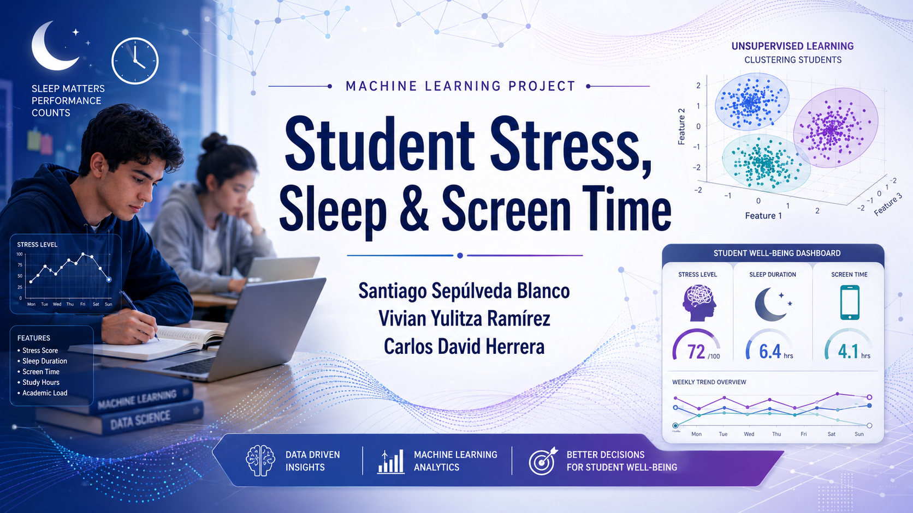

# Student Stress, Sleep & Screen Time

## Estudiantes

- Santiago Sepúlveda Blanco
- Vivian Yulitza Ramírez
- Carlos David Herrera

## Objetivo

El objetivo de este proyecto es analizar un dataset relacionado con estudiantes, sueño, tiempo en pantalla, hábitos académicos y nivel de estrés, aplicando diferentes técnicas de aprendizaje de máquina.

A lo largo del proyecto se trabajaron tres etapas principales:

1. **Análisis exploratorio de datos**
2. **Modelos supervisados de clasificación**
3. **Modelos no supervisados de agrupamiento**

La variable principal del proyecto es `stress_level`, la cual representa el nivel de estrés de los estudiantes.

## Dataset

El dataset utilizado contiene información de estudiantes y variables relacionadas con sus hábitos diarios y académicos.

### Variables principales

- `age`: edad del estudiante.
- `gender`: género del estudiante.
- `sleep_hours`: horas de sueño.
- `screen_time_hours`: tiempo en pantalla.
- `study_hours`: horas de estudio.
- `physical_activity`: actividad física.
- `caffeine_intake`: consumo de cafeína.
- `academic_pressure`: presión académica.
- `stress_level`: nivel de estrés del estudiante.

### Fuente del dataset

El dataset utilizado en este proyecto fue tomado de Kaggle:

[Student Stress, Sleep and Screen Time Dataset](https://www.kaggle.com/datasets/arpitabhaskar/student-stress-sleep-and-screen-time-dataset)

Además, el archivo usado en el notebook se encuentra dentro del repositorio:

[Ver dataset local](./student_stress_sleep_screen.csv)

## Metodología

El proyecto se dividió en tres entregas.

### Primera entrega: Análisis exploratorio

En esta etapa se realizó una revisión inicial del dataset para conocer su estructura, tipos de variables y posibles valores faltantes.

Se realizaron procesos como:

- Carga del dataset.
- Revisión de dimensiones.
- Análisis de variables numéricas y categóricas.
- Visualización de distribuciones.
- Revisión de valores nulos.
- Identificación de posibles anomalías.

### Segunda entrega: Modelos supervisados

En esta etapa se aplicaron modelos de clasificación para predecir el nivel de estrés de los estudiantes.

Antes del entrenamiento se realizaron algunos pasos de preparación:

- Eliminación de columnas no relevantes como identificadores.
- Conversión de variables categóricas a numéricas.
- Separación entre variables predictoras `X` y variable objetivo `y`.
- División del dataset en entrenamiento y prueba.

Modelos implementados:

- Decision Tree
- Random Forest
- SVM
- Deep Learning

Los modelos fueron comparados mediante métricas de rendimiento como el accuracy.

### Tercera entrega: Modelos no supervisados

En esta etapa se aplicaron técnicas de agrupamiento para analizar si los datos podían organizarse en grupos similares a los niveles reales de estrés.

Métodos implementados:

- StandardScaler
- PCA con 2 componentes
- KMeans
- DBSCAN

Para KMeans se usó el número de clusters igual al número de clases del dataset, es decir, 3 niveles de estrés:

- Low
- Medium
- High

Para DBSCAN se probaron diferentes valores de `eps` y `min_samples`, buscando una combinación que generara un número de clusters cercano a las clases reales y que mantuviera bajo el número de puntos marcados como ruido.

## Modelos y métodos implementados

### Preprocesamiento

- Conversión de variables categóricas usando `factorize()`.
- Escalamiento de datos con `StandardScaler`.
- Reducción de dimensionalidad con `PCA`.

### Modelos supervisados

- Decision Tree
- Random Forest
- SVM
- Red neuronal / Deep Learning

### Modelos no supervisados

- KMeans
- DBSCAN

## Resultados generales

En los modelos supervisados, se compararon diferentes algoritmos de clasificación para predecir el nivel de estrés. El mejor rendimiento se obtuvo con Decision Tree, seguido por modelos como Random Forest y SVM.

En los modelos no supervisados, PCA permitió reducir el dataset a dos componentes principales para visualizar los datos. KMeans permitió agrupar los datos en 3 clusters, mientras que DBSCAN permitió encontrar agrupaciones basadas en densidad e identificar algunos puntos como ruido.

## Archivos del repositorio

- [Notebook del proyecto](./Proyecto_AprendizajeMaquina.ipynb)
- [Dataset](./student_stress_sleep_screen.csv)
- [Presentación](./Presentacion_Student_Stress_ML.pdf)
- [Video Presentación](https://youtu.be/uwb6iA7-tiM)
- [Banner](./Banner.png)

## Presentación

La presentación resume las tres etapas del proyecto:

1. Exploración y análisis del dataset.
2. Entrenamiento y comparación de modelos supervisados.
3. Aplicación de PCA, KMeans y DBSCAN para aprendizaje no supervisado.

Puedes consultar la presentación aquí:

[Ver presentación](./Presentacion_Student_Stress_ML.pdf)

## Conclusiones

El proyecto permitió comparar enfoques supervisados y no supervisados para analizar el nivel de estrés estudiantil.

Los modelos supervisados fueron más adecuados para predecir directamente la variable `stress_level`, mientras que los modelos no supervisados permitieron visualizar la estructura de los datos, comparar agrupamientos y detectar posibles puntos atípicos.

En general, el análisis mostró que las variables relacionadas con sueño, tiempo en pantalla, estudio, presión académica y hábitos diarios pueden ser utilizadas para estudiar patrones asociados al estrés en estudiantes.
